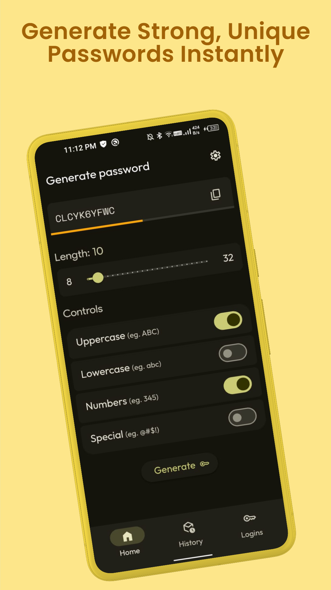
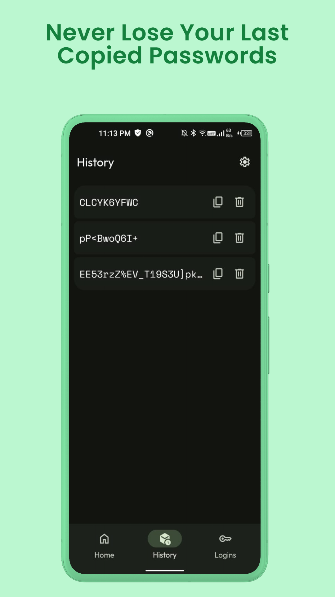
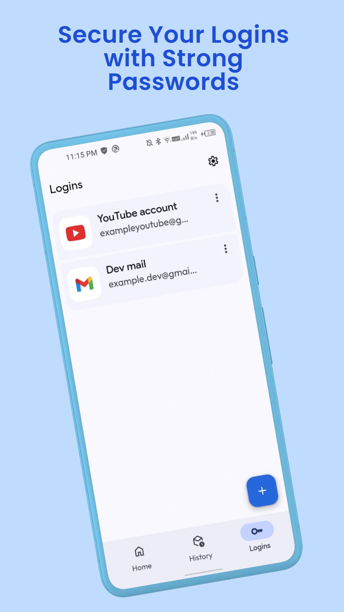
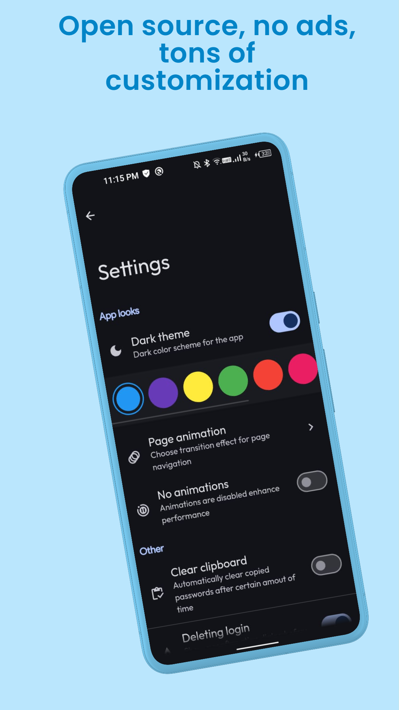

 # PassMaster 
 

PassMaster is developed with pure HTML, CSS, JavaScript, and Java. Designed to mimic the look and feel of a native Android app.

# 👁️ Preview

  

 

# 📲 Download

    

# ✨ Features:

 - <strong>Native Android Experience: </stronge>Enjoy a user interface and interaction that closely resemble a native Android PassMaster app.
   
 - <strong>Material Design: </stronge>The app is built using Material Web Components, ensuring a clean, consistent, and visually appealing design.

 - <strong>Customization Options: </stronge>Enjoy a ton of customization options. Adjust themes, layout, security settings.
   
 - <strong>Responsive Design: </stronge>PassMaster is fully responsive, providing a seamless experience across different devices and screen sizes.
   
 - <strong>User-Friendly Interface: </stronge>The app's interface is designed to be straightforward and user-friendly.

# 🛠️ Built With:

 - <strong>HTML & CSS: </stronge> For the basic structure and styling of the app.
   
 - <strong>JavaScript: </stronge>To handle the app's logic and interactivity.

 - <strong>Java: </stronge>Mainly used for JavaScript interface and permissions, allowing the app to run on Android devices.
   
 - <strong>Material Web Components: </stronge>Utilized to create a consistent and attractive Material Design look and feel.
   
 
 

> [!WARNING]
> The app is designed to run on Android devices and does not support web browsers. Attempting to open the app in a browser will not work.

 

# Contact
For any questions or feedback, feel free to open an issue on GitHub or contact pranshul.devmain@gmail.com

 

# License
This project is licensed under the MIT License. See the `LICENSE` file for details.

